# Canny-Edge-Detector
* First derivative of a Gaussian.
* Produces segments of thin image contours.
* Approximation to an operator that optimizes the product of signal-to-noise ratio and localization

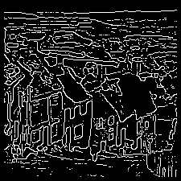
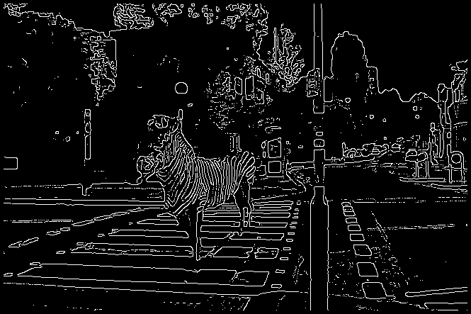

## Steps
Canny Edge Detector consists of four steps:

1. Gaussian smoothing: Smooth image with a Gaussian filter.
2. Gradient operation: Compute gradient magnitude and gradient angle at each pixel location of the smoothed location using SObel's operator.
3. Non-maxima suppression: Apply non-maxima suppression to gradient magnitude.
4. Thresholding: Simple thresholding or Double thresholding.

## Additional Considerations
* The input to your program is a grayscale image of size N X M.
* Use the 7 x 7 Gaussian mask as shown below for smoothing the input image. 
* Use the center of the mask as the reference center. If part of the Gaussian mask goes outside of the image border, let the output image be undefined at the location of the reference center. 

    Note: The entries in the Gaussian mask do not sum to 1. 

* After performing convolution (or cross-correlation), you need to perform normalization by dividing the results by the sum of the entries (= 140 for the given mask) at each pixel location. 

* If part of the 3 x 3 mask of the operator goes outside of the image border or lies in the undefined region of the image after Gaussian filtering, let the output value be undefined. For the third step, follow the procedure in the lecture slides for non-maxima suppression. 

* At locations with undefined gradient values and at locations where the center pixel has a neighbor with undefined gradient value, let the output be zero (i.e., no edge.) 

* For the fourth step, use double thresholding to threshold the gradient magnitude 𝑁(𝑖,𝑗) after non-maxima suppression into a
binary edge map 𝐸(𝑖,𝑗). Set up a low threshold 𝑇1 and a high threshold 𝑇2 so that 𝑇2 = 2𝑇1.

* If 𝑁(𝑖,𝑗) < 𝑇1, let 𝐸(𝑖,𝑗) = 0
* If 𝑁𝑁(𝑖,𝑗) > 𝑇2, let 𝐸(𝑖,𝑗) = 255
* If 𝑇1 ≤ 𝑁(𝑖,𝑗) ≤ 𝑇2, let 𝐸(𝑖,𝑗) = 255 if pixel (𝑖,𝑗) has an 8-connected neighbor (𝑖𝑖′,𝑗𝑗′) with gradient magnitude 𝑁𝑁(𝑖𝑖′,𝑗𝑗′) > 𝑇𝑇2 AND the gradient angles of (𝑖𝑖,𝑗𝑗) and (𝑖𝑖′,𝑗𝑗′) differ by 45° or less (i.e., |𝜃𝜃(𝑖𝑖,𝑗𝑗) − 𝜃𝜃(𝑖𝑖′,𝑗𝑗′)| ≤ 45°); otherwise, let 𝐸𝐸(𝑖𝑖,𝑗𝑗) = 0.

## Output

### Step 1: Gaussian smoothing & normalization
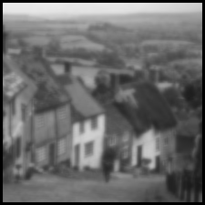
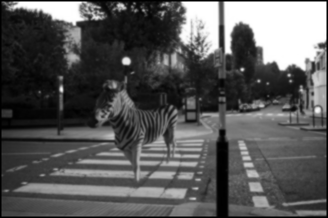

### Step 2: Writing Horizontal Gradient
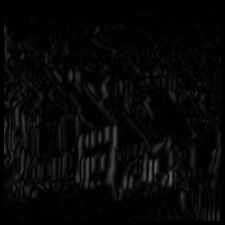
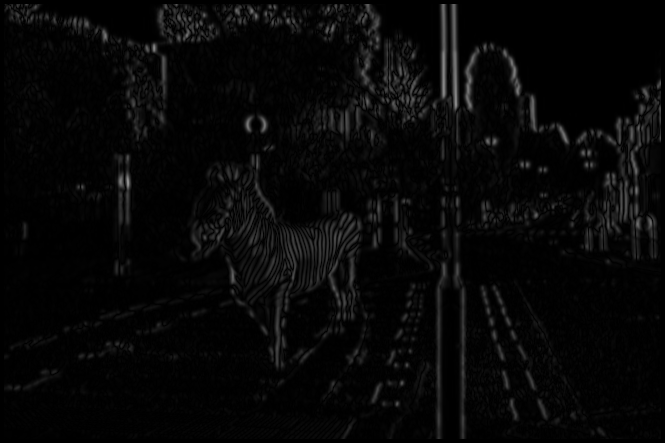

### Step 3 : Writing Vertical Gradient
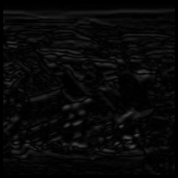
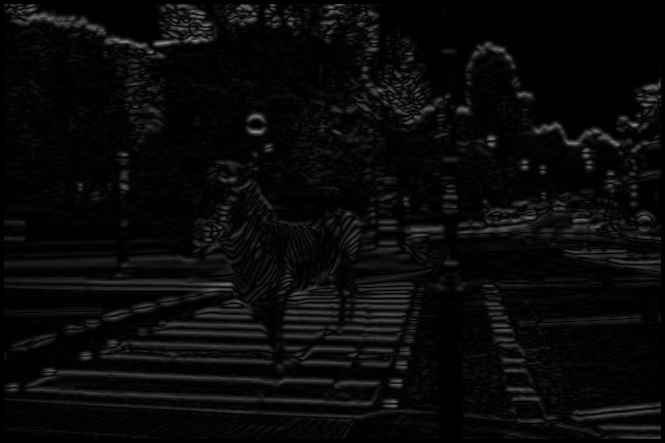

### Step 4: Writing Gradient Magnitude
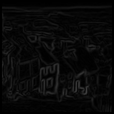
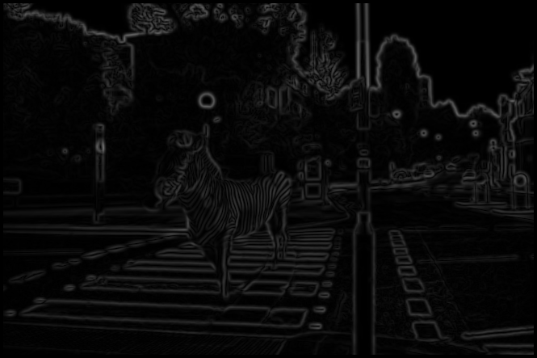

### Step 5: Apply non-maxima suppression to gradient magnitude
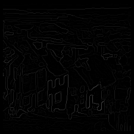
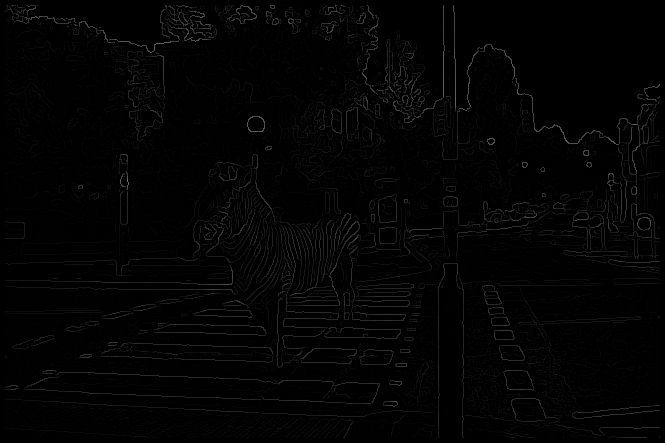

### Step 6: Double Thresholding

